# Enterprise GenAI Strategy Console

**A Google-Labs-style decision system that helps banking CTOs evaluate platform, architecture, cost, readiness, and launch strategy for GenAI initiatives — end-to-end, scenario-based, exportable.**


---

## The Hero Screenshot

> **One scenario → five agents → a decision brief + export pack**

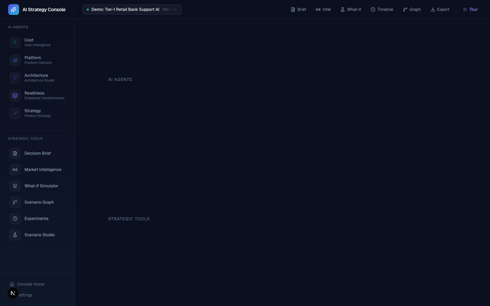

*The console workspace: scenario selector (top), agent navigation (left), embedded module (center), strategic tools (sidebar). Every agent runs within the console shell — no tab switching, no context loss.*

---

## 30-Second Demo

```
1. Open /scenario-studio → select "Tier-1 Retail Bank Support AI"
2. Run Platform Agent → click Export
3. Run Architecture Agent → Export
4. Run Cost Agent → Export
5. Open /m/brief → see Decision Brief + Export JSON
6. Open /m/counterfactual → simulate Azure alternative
7. Open /m/experiments → see full decision timeline
```

Or click **Guided Tour (45s)** on the landing page — the console walks you through it.

---

## Screenshots

### Landing Page

*AI-agent themed landing page with workflow visualization and agent cards.*

### Scenario Studio
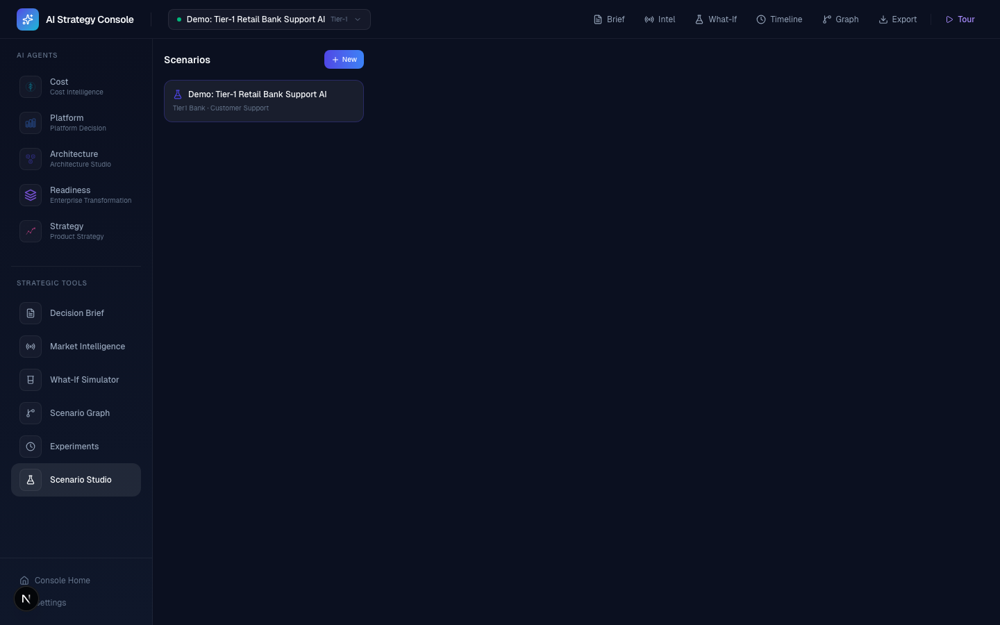
*Configure banking scenarios: institution type, use case, data gravity, security, deployment, traffic, RAG parameters.*

### Platform Agent (Embedded)
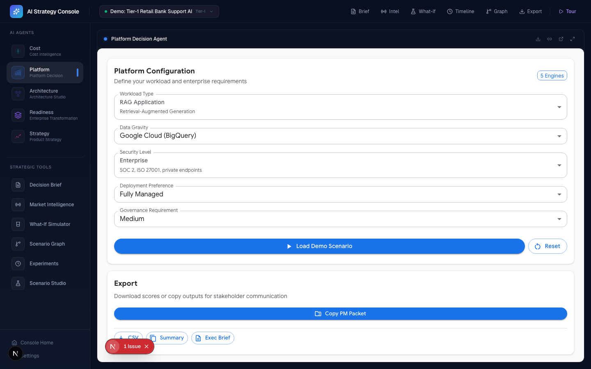
*Platform Comparator running inside the console — compares Vertex AI vs Azure OpenAI vs AWS Bedrock.*

### Architecture Agent (Embedded)
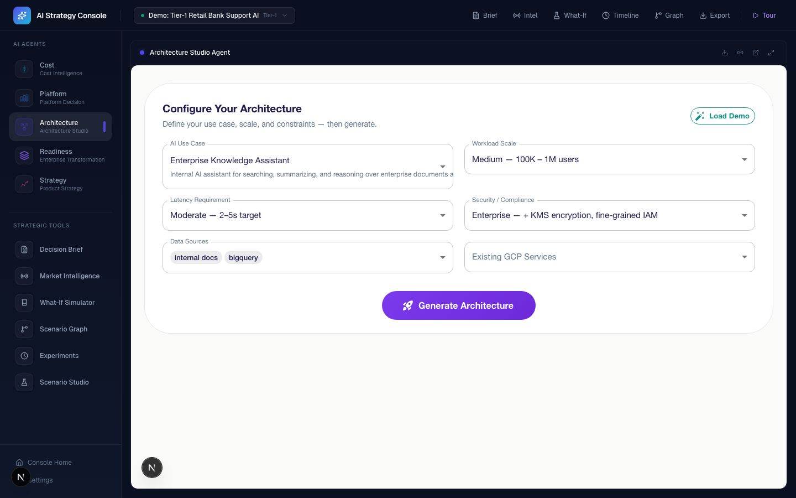
*Architecture Generator producing deployable reference architectures for the active scenario.*

### Cost Agent (Embedded)

*Cost Simulator modeling total cost across inference, embeddings, RAG, infrastructure, and observability.*

### Readiness Agent (Embedded)
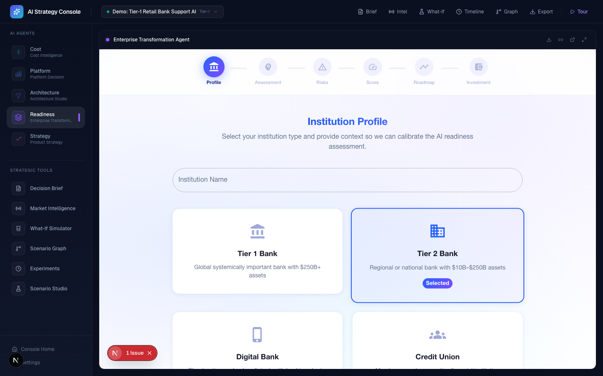
*Enterprise AI Readiness Analyzer evaluating organizational preparedness across 5 dimensions.*

### Strategy Agent (Embedded)
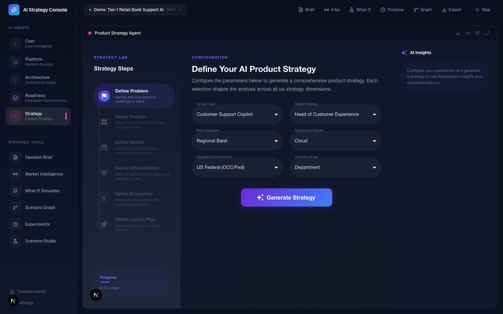
*Launch Strategy Generator producing go-to-market plans with competitive positioning.*

### Decision Brief
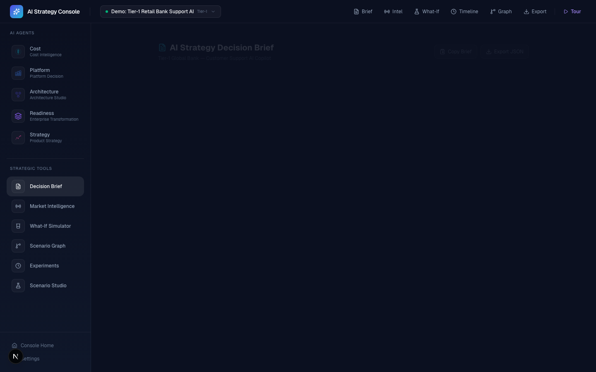
*Aggregated executive brief: platform recommendation, architecture, cost projection, readiness score, risk analysis, launch plan, market signals, and counterfactual alternatives.*

### Market Intelligence
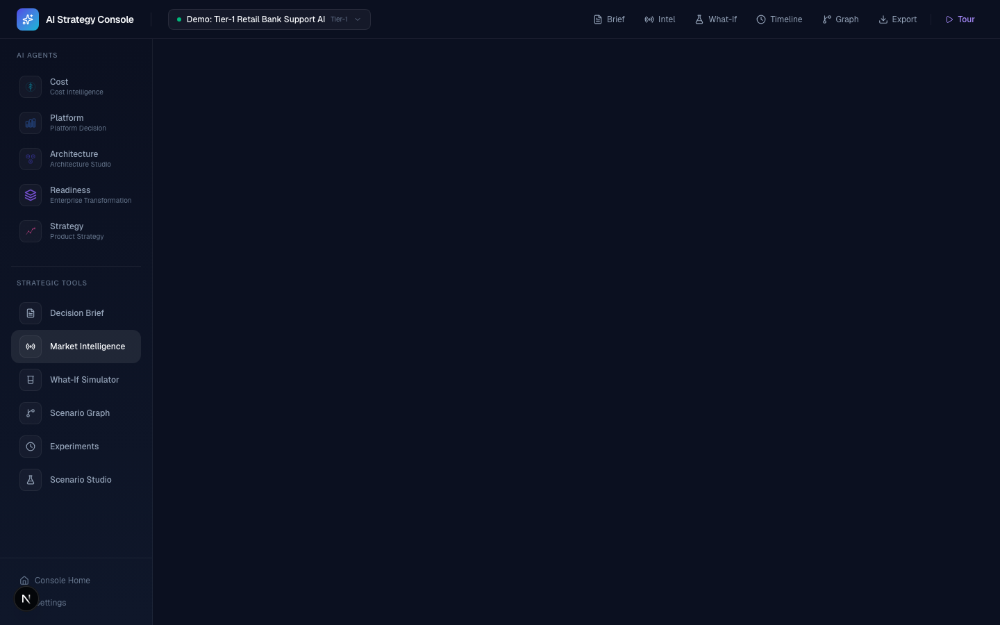
*Live model release tracker, pricing monitor, ecosystem activity dashboard, and auto-generated intelligence insights.*

### Counterfactual Simulator
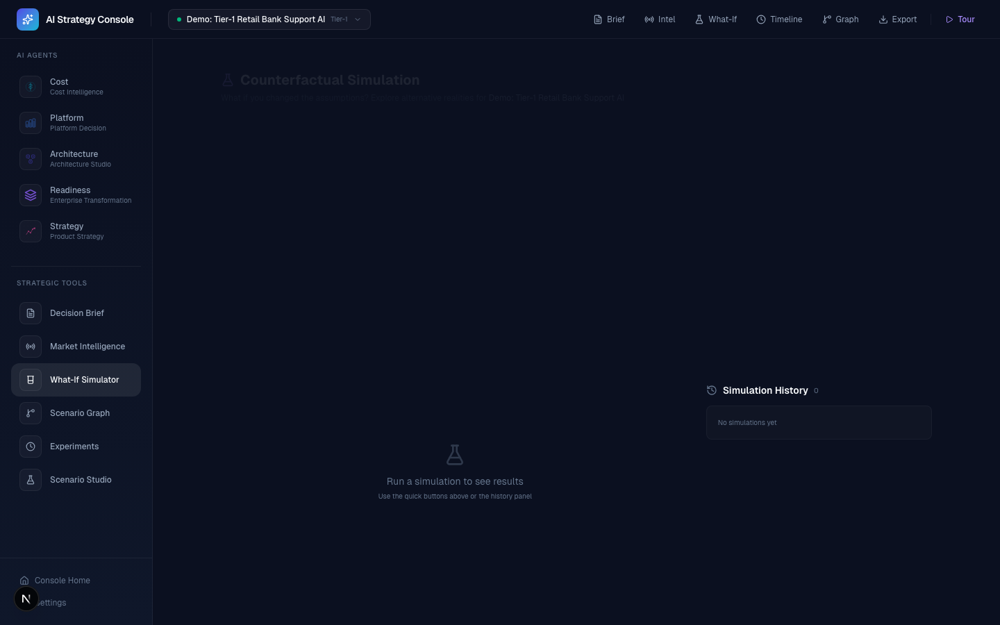
*What-if analysis: "Simulate Azure", "Double Traffic", "Tighter Latency" — see cost/readiness/score deltas instantly.*

### Experiment Timeline
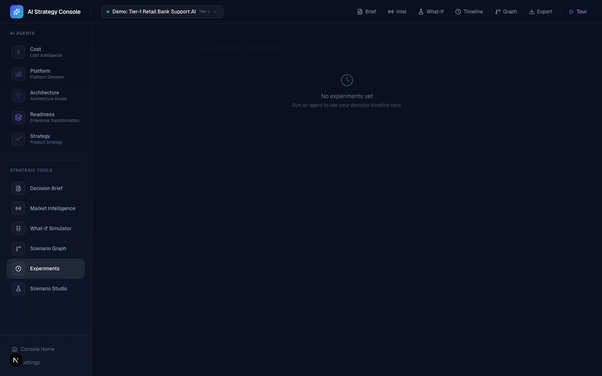
*Every agent run and counterfactual simulation tracked with full decision traceability.*

### Scenario Graph
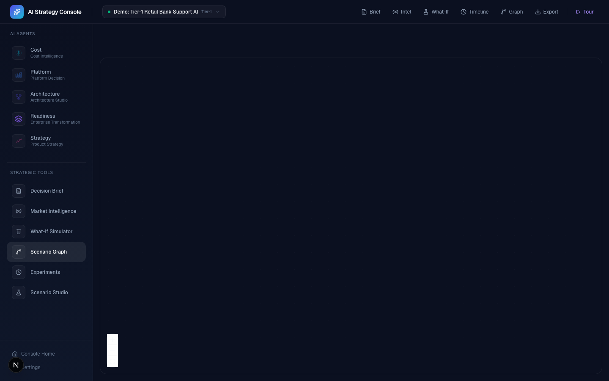
*Visual graph showing scenario → agent → output → brief flow with ReactFlow.*

---

## What This System Does

- **Runs the same banking AI scenario across 5 specialized agents** — Platform, Architecture, Cost, Readiness, Strategy
- **Captures results via a cross-tool message protocol** — `postMessage` bridge with origin validation
- **Synthesizes outputs into an executive Decision Brief** — with risk analysis, launch plan, and export pack
- **Runs counterfactual simulations** — "What if Azure? What if traffic doubled?" with instant delta comparison
- **Tracks an Experiment Timeline** — every agent run becomes a replayable, auditable event

---

## What Makes It Internal-Tool Grade

| Feature | What It Does |
|---------|-------------|
| **Multi-Scenario Experimentation** | Create, duplicate, compare banking scenarios with full persistence |
| **Cross-Tool Orchestration** | `postMessage` handshake + origin validation between console and 5 agents |
| **Decision Brief Aggregation** | Synthesizes real agent outputs into an exec-ready brief |
| **Counterfactual Simulation** | Platform/traffic/latency/deployment/security overrides with delta analysis |
| **Market Intelligence Layer** | Model releases, pricing trends, ecosystem activity → auto-generated insights |
| **Experiment Timeline + Replay** | Full decision traceability — every run logged and replayable |
| **Guided Tour** | 7-step interactive walkthrough with spotlight overlay and keyboard navigation |
| **Scenario Graph Engine** | ReactFlow visualization of scenario → agent → output data flow |

---

## Quickstart

```bash
# Clone
git clone https://github.com/Phani3108/Enterprise-GenAI-Console.git
cd Enterprise-GenAI-Console

# Install
npm install

# Run console only
npm run dev

# Run full suite (console + 5 agents)
npm run dev:all
```

**`dev:all` assumes sibling folders:**

```
/your-workspace
  /Enterprise-GenAI-Console        → localhost:3000
  /GenAICostCalulator               → localhost:3001
  /AIPlatformComparator             → localhost:3002
  /VertexAIArchitectureGenerator    → localhost:3003
  /Enterprise-AI-Analyzer---Banking → localhost:3004
  /AI-Product-Strategy-Lab---Financial-Institutions → localhost:3005
```

If a tool server isn't running, the console shows an "Agent Offline" card — it never breaks.

---

## Suite Repositories

| # | Repository | Port | Role |
|---|-----------|------|------|
| 0 | **[Enterprise-GenAI-Console](https://github.com/Phani3108/Enterprise-GenAI-Console)** | 3000 | Orchestrator Console |
| 1 | [GenAICostCalulator](https://github.com/Phani3108/GenAICostCalulator) | 3001 | Cost Simulation Agent |
| 2 | [AIPlatformComparator](https://github.com/Phani3108/AIPlatformComparator) | 3002 | Platform Comparison Agent |
| 3 | [VertexAIArchitectureGenerator](https://github.com/Phani3108/VertexAIArchitectureGenerator) | 3003 | Architecture Generation Agent |
| 4 | [Enterprise-AI-Analyzer---Banking](https://github.com/Phani3108/Enterprise-AI-Analyzer---Banking) | 3004 | Enterprise Readiness Agent |
| 5 | [AI-Product-Strategy-Lab](https://github.com/Phani3108/AI-Product-Strategy-Lab---Financial-Institutions) | 3005 | Launch Strategy Agent |

---

## Scoring & Defensibility

### What inputs cause each platform to win

| Scenario | Likely Winner | Why |
|----------|--------------|-----|
| BigQuery + regulated + RAG | **Vertex AI** | Data gravity + governance + native vector search |
| Microsoft estate + M365 + Purview | **Azure OpenAI** | Enterprise integration + compliance tooling |
| AWS-native org + S3/Lambda + Bedrock-first | **AWS Bedrock** | Infra alignment + broad model access |
| Open-source priority + self-hosted | **Llama on Vertex/Self-hosted** | No vendor lock-in + cost control |

### How scoring works
- **Data gravity** contributes 40% — where your data lives determines platform affinity
- **Security/compliance tier** contributes 25% — regulated environments favor platforms with built-in governance
- **Market intelligence signals** contribute 15% — recent model releases, pricing trends, ecosystem momentum
- **Traffic + latency** contribute 20% — high-throughput scenarios favor platforms with better auto-scaling

### How to override
Weights can be modified in `src/services/simulation/runSimulation.ts`. The counterfactual simulator lets you change any parameter and see the impact instantly.

---

## 90-Second Demo Script (Loom)

| Time | Action | What to Say |
|------|--------|-------------|
| 0:00 | Show landing page | *"This is an enterprise AI strategy console for banks."* |
| 0:10 | Open Scenario Studio | *"Start with a banking scenario — Tier-1 bank, customer support, BigQuery, regulated."* |
| 0:20 | Open Platform Agent | *"The platform agent compares Vertex AI, Azure, and Bedrock against your constraints."* |
| 0:30 | Open Architecture Agent | *"Architecture agent generates a deployable reference architecture."* |
| 0:40 | Open Cost Agent | *"Cost agent models total infrastructure cost — inference, RAG, networking, observability."* |
| 0:50 | Open Decision Brief | *"The brief synthesizes all five agents into an exec-ready recommendation."* |
| 1:00 | Open Counterfactual | *"What if we used Azure instead? The simulator shows cost +28%, readiness −6."* |
| 1:10 | Open Experiment Timeline | *"Every run is tracked — full decision traceability."* |
| 1:20 | Open Market Intelligence | *"Live market signals — model releases, pricing trends, ecosystem activity."* |
| 1:30 | Close | *"One scenario, five agents, one decision brief. Built with Next.js, TypeScript, Zustand."* |

---

## Design Philosophy

- **Console is visually distinct from tools** — dark navy base with neon cyan/violet accents (agents use MUI with standard palettes)
- **Agents are metaphors** — Platform Agent, Architecture Agent, etc. — not "Tool 1, Tool 2"
- **Local-first** — zero backend, localStorage persistence, runs entirely on your machine
- **Graceful degradation** — console works if 0, 1, or all 5 agents are running
- **Product-grade UX** — loading skeletons, offline cards, spotlight tour, keyboard navigation

---

## Project Structure

```
src/
├── app/
│   ├── page.tsx                    # Landing page
│   ├── layout.tsx                  # Root layout + tour provider
│   ├── console/page.tsx            # Console workspace
│   ├── scenario-studio/page.tsx    # Scenario CRUD
│   ├── guided-tour/page.tsx        # Tour launcher
│   └── m/
│       ├── platform/page.tsx       # Platform Agent embed
│       ├── architecture/page.tsx   # Architecture Agent embed
│       ├── cost/page.tsx           # Cost Agent embed
│       ├── readiness/page.tsx      # Readiness Agent embed
│       ├── strategy/page.tsx       # Strategy Agent embed
│       ├── brief/page.tsx          # Decision Brief
│       ├── intelligence/page.tsx   # Market Intelligence
│       ├── counterfactual/page.tsx  # What-If Simulator
│       ├── experiments/page.tsx    # Experiment Timeline
│       └── graph/page.tsx          # Scenario Graph
├── components/
│   ├── console/                    # Shell: sidebar, topbar, layout
│   ├── modules/                    # ModuleFrame, loader
│   ├── intelligence/               # Model tracker, pricing, ecosystem
│   ├── simulation/                 # DeltaPanel, SimulationCard
│   ├── experiments/                # ExperimentCard, timeline
│   ├── tour/                       # Overlay, spotlight, tooltip, progress
│   └── ui/                         # NeonCard, GlowButton, AnimatedGrid
├── store/
│   ├── scenarioStore.ts            # Multi-scenario CRUD + persistence
│   ├── exportStore.ts              # Agent output aggregation
│   ├── experimentStore.ts          # Decision timeline
│   ├── intelligenceStore.ts        # Market signal management
│   ├── counterfactualStore.ts      # Simulation history
│   └── tourStore.ts                # Guided tour state machine
├── services/
│   ├── intelligence/               # Signal loader + insight generator
│   └── simulation/                 # Counterfactual engine
├── data/
│   ├── modules.json                # Agent registry
│   └── intelligence/               # Curated model/pricing/ecosystem data
├── tour/
│   └── tourSteps.ts                # Tour step definitions
├── utils/
│   ├── postMessageBridge.ts        # Cross-tool communication
│   ├── encodeScenario.ts           # URL param encoding
│   ├── clipboard.ts                # Copy utilities
│   └── moduleRegistry.ts           # Module config loader
└── lib/
    ├── brief/                      # Decision brief generator
    └── explanations/               # Transparent reasoning engine
```

---

## What This Demonstrates

| Capability | Evidence |
|-----------|----------|
| **Product Thinking** | Scenario-based workflow mirrors real enterprise decision process |
| **System Design** | 6 independent apps orchestrated via message protocol |
| **Data-Driven Decisions** | Market intelligence → scoring → counterfactual analysis |
| **Enterprise UX** | Offline handling, guided tour, keyboard navigation, export packs |
| **Technical Depth** | Zustand stores, postMessage bridge, ReactFlow, Framer Motion |
| **Decision Science** | Counterfactual simulation with delta analysis |
| **Ecosystem Awareness** | Live model tracking, pricing monitoring, developer ecosystem signals |
| **Audit & Compliance** | Experiment timeline with full decision traceability |

---

## Tech Stack

- **Framework**: Next.js 16 (App Router) + TypeScript
- **Styling**: Tailwind CSS (dark futuristic theme)
- **State**: Zustand + localStorage persistence
- **Animation**: Framer Motion
- **Graph**: ReactFlow
- **Tools**: MUI (Material UI) in embedded agents
- **Orchestration**: Concurrently (dev:all script)
- **Communication**: window.postMessage with origin validation

---

## Roadmap

- [ ] Real API integration (HuggingFace, GitHub API, vendor pricing feeds)
- [ ] PDF export for Decision Brief
- [ ] Multi-user collaboration with shared scenarios
- [ ] CI/CD pipeline with automated screenshots
- [ ] Webhook integration for Slack/Teams notifications
- [ ] Advanced scoring model with configurable weights UI

---

*Built as part of the AI Infra Decision Suite — a comprehensive system for enterprise GenAI strategy.*

---

## Author

**Created & developed by [Phani Marupaka](https://linkedin.com/in/phani-marupaka)**

© 2026 Phani Marupaka. All rights reserved.

Unauthorized reproduction, distribution, or modification of this software, in whole or in part, is strictly prohibited under applicable trademark and copyright laws including but not limited to the Digital Millennium Copyright Act (DMCA), the Lanham Act (15 U.S.C. § 1051 et seq.), and equivalent international intellectual property statutes. This software contains embedded provenance markers and attribution watermarks that are protected under 17 U.S.C. § 1202 (integrity of copyright management information). Removal or alteration of such markers constitutes a violation of federal law.
