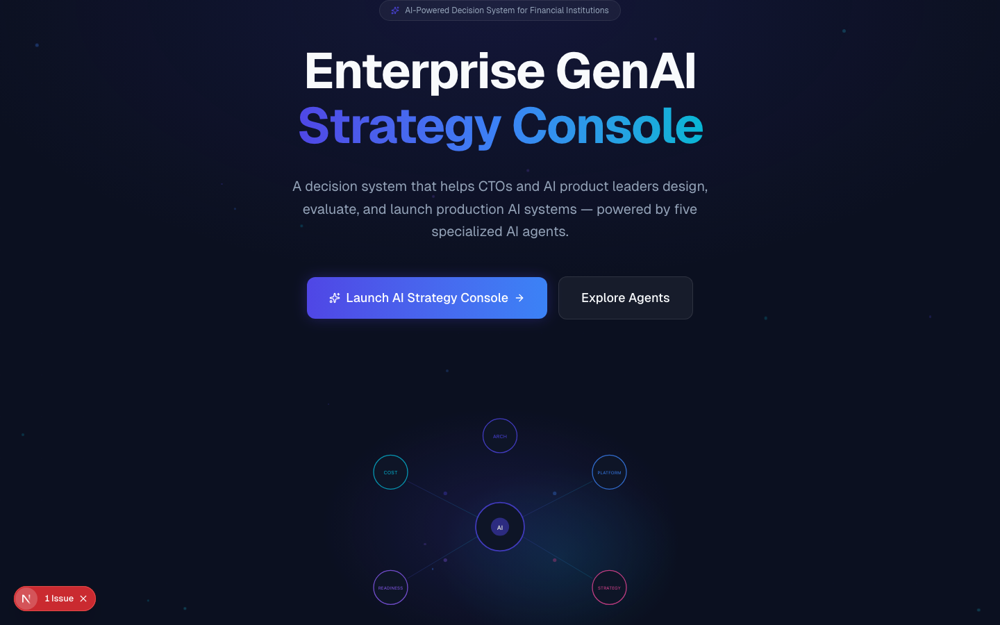
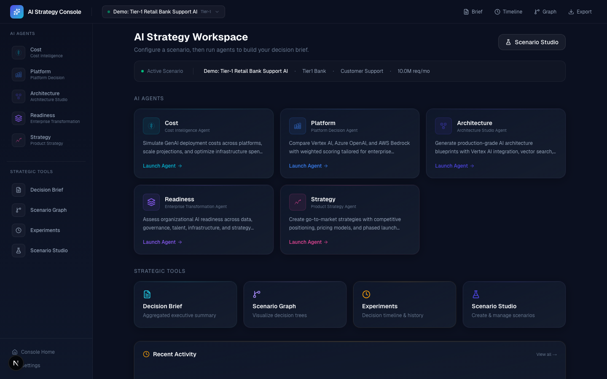
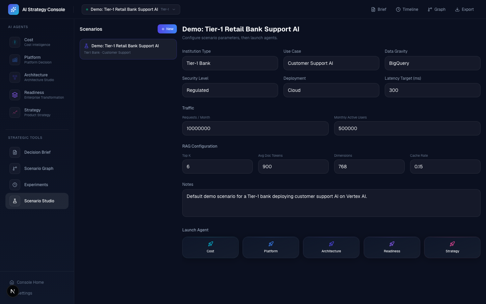
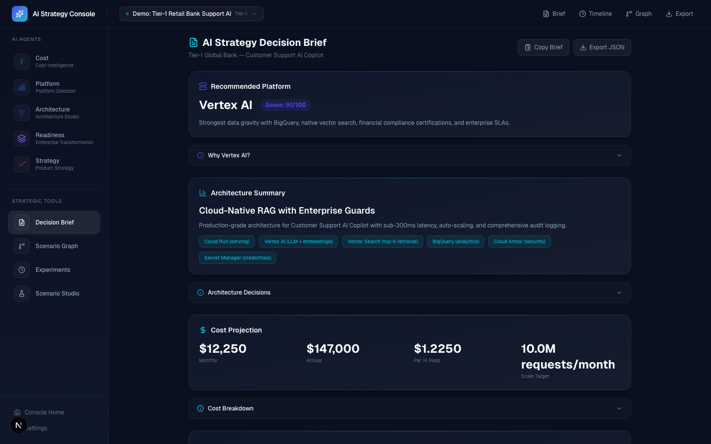
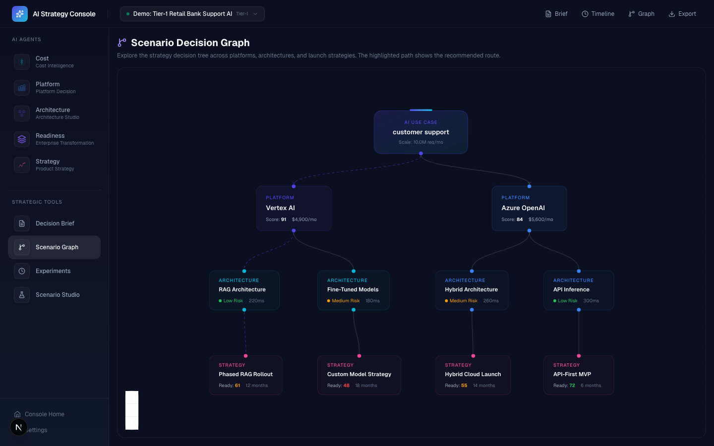
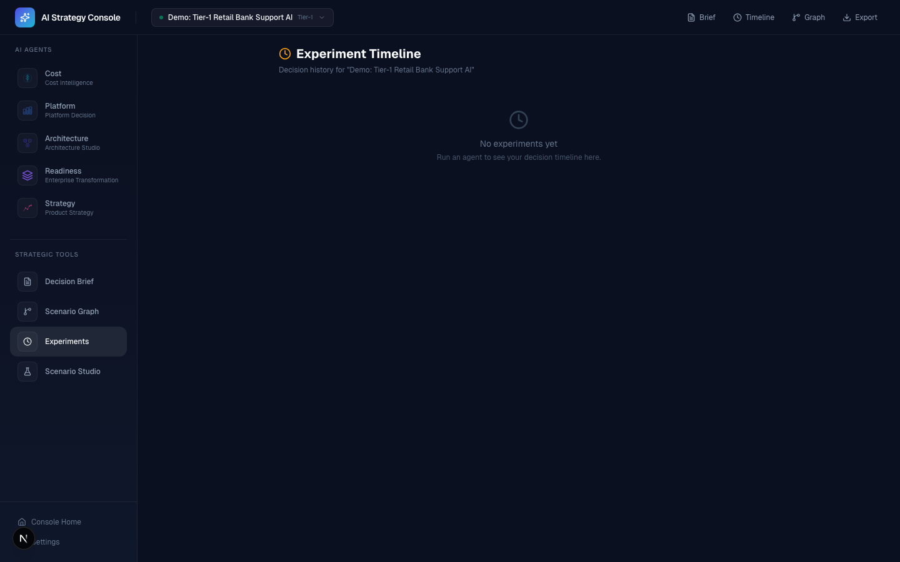
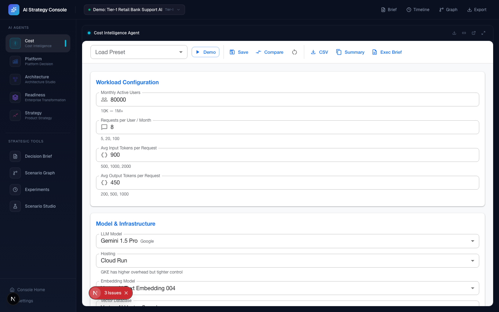
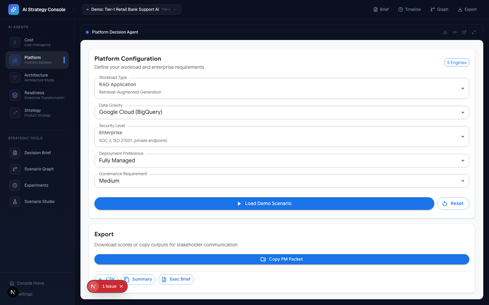
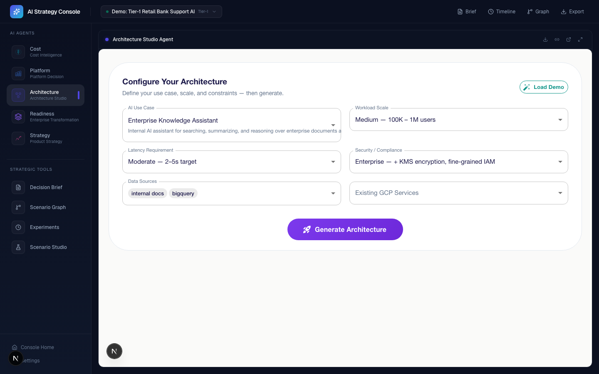
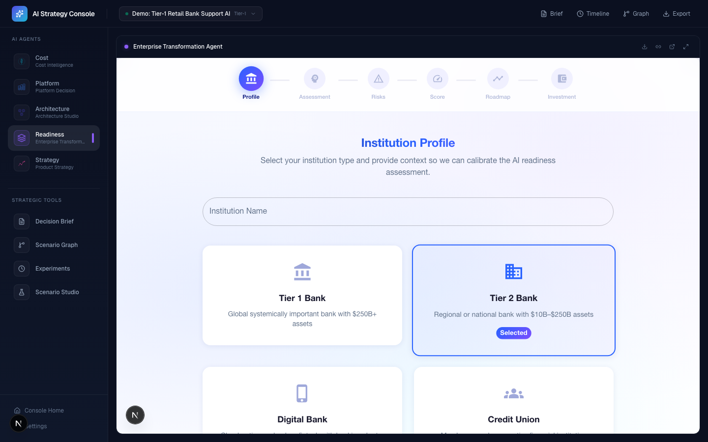

# Enterprise GenAI Strategy Console

**A Google-Labs-style decision system that helps banking CTOs evaluate platform, architecture, cost, readiness, and launch strategy for GenAI initiatives — end-to-end, scenario-based, exportable.**

One scenario flows through five specialized AI agents. Each agent produces structured output. The console aggregates everything into a decision brief, an experiment timeline, and a downloadable export pack.

---

## Screenshots

### Landing Page
The futuristic AI-agent themed entry point — dark navy base with neon accents and animated grid background.



### Console Workspace
The main command center — agent grid, active scenario bar, strategic tools, and recent experiment activity.



### Scenario Studio
Multi-scenario editor with full banking parameter configuration — institution type, use case, data gravity, security, deployment, traffic, RAG config, and agent launch buttons.



### AI Strategy Decision Brief
Aggregated executive brief with platform recommendation (scored), architecture summary, cost projection, readiness scoring, risk analysis, launch plan, and experiment timeline. Copy to clipboard or download JSON.



### Scenario Decision Graph
Interactive ReactFlow decision tree showing platform → architecture → strategy paths with scoring and risk indicators.



### Experiment Timeline
Decision history log — every agent run creates a timestamped, replayable experiment event.



### Cost Intelligence Agent (embedded)
Full 6-layer cost simulator running inside the console — workload configuration, model comparison, architecture diagrams, and optimization insights.



### Platform Decision Agent (embedded)
5 evaluation engines comparing Vertex AI vs Azure OpenAI vs AWS Bedrock with weighted scoring, capability matrix, lock-in analysis, and migration estimator.



### Architecture Studio Agent (embedded)
Generate production-grade Vertex AI architectures with diagrams, blueprints, security plans, and cost estimates for 10 AI use cases across 3 tiers.



### Enterprise Transformation Agent (embedded)
6-step guided AI readiness assessment — institution profiling, capability scoring, risk landscape, maturity gauge, adoption roadmap, and investment planning.



### Product Strategy Agent (embedded)
Codelabs-style strategy lab — problem definition, product concept, market positioning, friction analysis, pricing models, and phased launch timeline.


---

## System Architecture

<p align="center">
  
</p>

---

## Try the demo in 30 seconds

```
1. Open /scenario-studio → select "Demo: Tier-1 Retail Bank Support AI"
2. Launch Platform Agent → explore the scoring, click Export
3. Launch Architecture Agent → generate architecture, Export
4. Launch Cost Agent → simulate costs, Export
5. Open /m/brief → see the Decision Brief, Export JSON, and Experiment Timeline
```

**One scenario → five agents → a decision brief + export pack.**

---

## What this does

- Runs the same banking AI scenario across **5 specialized agents** (platform, architecture, cost, readiness, strategy)
- Captures results via a **cross-tool postMessage protocol** with origin validation
- Synthesizes outputs into a **Decision Brief** with copy-to-clipboard and JSON download
- Stores an **Experiment Timeline** — every export becomes a timestamped, replayable event
- Produces an **Export Pack JSON** for sharing, audit trails, or stakeholder review

---

## What makes it internal-tool grade

| Feature | Why it matters |
|---------|---------------|
| **Multi-scenario experimentation** | Create, duplicate, rename, compare — persisted in localStorage |
| **Cross-tool orchestration** | postMessage handshake (TOOL_READY / TOOL_EXPORT / REQUEST_EXPORT) with origin validation |
| **Decision brief aggregation** | Built from actual tool exports, not mock data |
| **Experiment timeline + replay** | Every agent run is logged with timestamp, highlights, and a "Replay" action |
| **Scenario graph explorer** | ReactFlow decision tree showing platform → architecture → strategy paths |
| **Offline resilience** | Console runs even if agent servers are down — shows OfflineModuleCard with start commands |

---

## System Architecture

```
Enterprise GenAI Strategy Console (port 3000)
│
├── Scenario Store ─── localStorage persistence
├── Export Store   ─── scenarioId → toolId → payload
├── Experiment Store ─ timestamped decision log
│
├── postMessage Bridge (origin-validated)
│   ├── TOOL_READY     ← module finished loading
│   ├── REQUEST_EXPORT → console asks for data
│   └── TOOL_EXPORT    ← module sends results
│
├── ModuleFrame (iframe + native feel)
│   ├── ?embed=1&theme=console-darklabs
│   ├── ?scenario=<encoded JSON>
│   └── ?returnUrl=<console route>
│
└── 5 AI Agents (independent Next.js apps)
    ├── Cost Intelligence Agent         :3001
    ├── Platform Decision Agent         :3002
    ├── Architecture Studio Agent       :3003
    ├── Enterprise Transformation Agent :3004
    └── Product Strategy Agent          :3005
```

---

## Quickstart

### Console only

```bash
npm install
npm run dev          # http://localhost:3000
```

### Full suite (console + all 5 agents)

```bash
npm run dev:all      # Starts 6 servers via concurrently
```

Assumes sibling folder layout:

```
/your-workspace
  /Enterprise-GenAI-Console         ← you are here
  /GenAICostCalulator               ← port 3001
  /AIPlatformComparator             ← port 3002
  /VertexAIArchitectureGenerator    ← port 3003
  /Enterprise-AI-Analyzer---Banking ← port 3004
  /AI-Product-Strategy-Lab---Financial-Institutions ← port 3005
```

If a sibling repo is missing, the console still runs — affected modules show an "Agent Offline" card with hints.

---

## Suite Repositories

| # | Agent | Repository | Port |
|---|-------|-----------|------|
| 0 | **Console (this repo)** | [Enterprise-GenAI-Console](https://github.com/Phani3108/Enterprise-GenAI-Console) | 3000 |
| 1 | Cost Intelligence Agent | [GenAICostCalulator](https://github.com/Phani3108/GenAICostCalulator) | 3001 |
| 2 | Platform Decision Agent | [AIPlatformComparator](https://github.com/Phani3108/AIPlatformComparator) | 3002 |
| 3 | Architecture Studio Agent | [VertexAIArchitectureGenerator](https://github.com/Phani3108/VertexAIArchitectureGenerator) | 3003 |
| 4 | Enterprise Transformation Agent | [Enterprise-AI-Analyzer---Banking](https://github.com/Phani3108/Enterprise-AI-Analyzer---Banking) | 3004 |
| 5 | Product Strategy Agent | [AI-Product-Strategy-Lab---Financial-Institutions](https://github.com/Phani3108/AI-Product-Strategy-Lab---Financial-Institutions) | 3005 |

---

## Scoring Methodology & Defensibility

### How the platform recommendation works

The console does **not** hardcode a winner. Platform scores are computed from scenario inputs:

| Input | Effect |
|-------|--------|
| **Data gravity** | BigQuery → favors Vertex; S3 → favors Bedrock; On-prem → favors Azure |
| **Security level** | `regulated` adds compliance weight; shifts toward platforms with more certifications |
| **Deployment model** | `private` increases Azure hybrid score; `cloud` favors Vertex/Bedrock |
| **Traffic volume** | Higher volume amplifies cost efficiency differentials |

### When each platform wins

| Scenario | Likely Winner | Why |
|----------|--------------|-----|
| BigQuery + regulated + RAG | **Vertex AI** | Data gravity + native Vector Search + financial compliance certs |
| Microsoft estate + M365 + Purview + on-prem | **Azure OpenAI** | Enterprise AD integration + 90+ compliance certs + hybrid deployment |
| AWS-native org + S3 + Lambda + Bedrock-first | **AWS Bedrock** | Infrastructure alignment + model diversity + reserved capacity savings |
| Multi-cloud + minimal lock-in requirement | **Vertex or Bedrock** | Both offer broad model access; Vertex wins on BigQuery gravity |
| Strict data residency + private cloud | **Azure OpenAI** | Azure Arc enables hybrid/on-prem with regulatory compliance |

### How to override

- Platform scoring weights live in `data/scoring_weights.json` in the Platform Comparator tool
- Cost assumptions live in `data/pricing.default.json` in the Cost Simulator
- Architecture templates are configurable in `data/architecture_templates.json`
- All datasets are versioned JSON — no hardcoded values

---

## Demo Script (90 seconds)

Use this structure for a walkthrough or Loom recording:

| Time | Action | What you say |
|------|--------|-------------|
| 0:00 | Open `/` | "This is an enterprise AI strategy console for banks." |
| 0:10 | Open `/scenario-studio` | "I pick a Tier-1 bank scenario — customer support AI, 10M requests/month, regulated." |
| 0:20 | Click Platform Agent | "The Platform Agent scores Vertex vs Azure vs Bedrock. Vertex wins on data gravity." |
| 0:35 | Click Export in module | "I export the result — it flows to the console's export store via postMessage." |
| 0:40 | Click Architecture Agent | "Now I generate the architecture — Cloud-Native RAG with enterprise guards." |
| 0:50 | Click Cost Agent | "Cost simulation: $12K/month at scale with optimization insights." |
| 1:00 | Open `/m/brief` | "The Decision Brief aggregates all exports. Copy to clipboard or download JSON." |
| 1:10 | Scroll to timeline | "Every agent run is logged in the Experiment Timeline. I can replay any of them." |
| 1:20 | Open `/m/graph` | "The Scenario Graph shows the full decision tree." |

---

## Design Philosophy

### Why this looks different from the tools

The console uses a **distinct visual language** to signal "this is the orchestrator, not another tool":

| Aspect | Console | Tools |
|--------|---------|-------|
| Theme | Dark navy + neon cyan/violet | MUI default dark |
| Background | Animated grid + floating particles | Static |
| Cards | Glow-on-hover with color accent borders | Standard MUI cards |
| Icons | Custom SVG agent icons | Lucide/MUI icons |
| Navigation | Vertical sidebar with agent metaphors | Horizontal app bar |

### Assumptions

- All tools support `?embed=1` to hide their native header
- Tools read `scenario` from URL params for prefilling
- Console runs on port 3000; tools on 3001–3005
- No backend required — all state is localStorage
- postMessage bridge validates origin against allowed ports

---

## Project Structure

```
src/
├── app/
│   ├── page.tsx                    # Landing page (product narrative)
│   ├── console/page.tsx            # Console workspace (agent grid + recent timeline)
│   ├── scenario-studio/page.tsx    # Multi-scenario editor
│   └── m/
│       ├── cost/page.tsx           # Cost Agent embed
│       ├── platform/page.tsx       # Platform Agent embed
│       ├── architecture/page.tsx   # Architecture Agent embed
│       ├── readiness/page.tsx      # Readiness Agent embed
│       ├── strategy/page.tsx       # Strategy Agent embed
│       ├── brief/page.tsx          # Decision Brief + export
│       ├── graph/page.tsx          # Scenario Decision Graph
│       └── experiments/page.tsx    # Experiment Timeline
├── components/
│   ├── console/                    # Layout, Sidebar, Topbar, ScenarioSelector, AgentNavItem, OfflineModuleCard
│   ├── modules/                    # ModuleFrame (postMessage + copy link + export), ModuleLoader
│   ├── experiments/                # ExperimentTimeline, ExperimentCard
│   ├── graph/                      # ScenarioGraph + node components (ReactFlow)
│   ├── brief/                      # ExplanationPanel (transparent reasoning)
│   └── ui/                         # NeonCard, GlowButton, AnimatedGrid, FloatingIcons, RadarBackground
├── store/
│   ├── scenarioStore.ts            # Multi-scenario CRUD + localStorage
│   ├── exportStore.ts              # Tool export aggregation + composeBrief + downloadPack
│   └── experimentStore.ts          # Experiment event log + localStorage
├── lib/
│   ├── brief/                      # Decision brief generation engine
│   └── explanations/               # Factor analysis for platform, cost, architecture
├── utils/
│   ├── postMessageBridge.ts        # Cross-tool communication (TOOL_READY / TOOL_EXPORT / REQUEST_EXPORT)
│   ├── encodeScenario.ts           # Scenario URL encoding + module URL builder
│   ├── moduleRegistry.ts           # Typed module config access
│   └── clipboard.ts                # Copy-to-clipboard utility
├── data/
│   └── modules.json                # Agent registry (id, port, path, color, repo)
└── styles/
    └── motion.ts                   # Framer Motion animation variants
```

---

## Tech Stack

| Layer | Technology |
|-------|-----------|
| Framework | Next.js 16 (App Router, Turbopack) |
| Language | TypeScript (strict) |
| Styling | Tailwind CSS 4 |
| Animation | Framer Motion |
| State | Zustand (3 stores: scenario, export, experiment) |
| Graph | ReactFlow |
| Icons | Lucide React + custom SVG |
| Orchestration | concurrently (dev:all script) |
| Persistence | localStorage (no backend) |

---

## What This Demonstrates

| Capability | How |
|-----------|-----|
| **System design** | Multi-tool orchestration with iframe embedding, postMessage protocol, shared state |
| **Platform knowledge** | Vertex AI, Azure OpenAI, AWS Bedrock — weighted scoring with defensible methodology |
| **Enterprise architecture** | Production AI deployment patterns, RAG architectures, security plans |
| **Product thinking** | Scenario modeling, experiment tracking, export packs, decision synthesis |
| **Economic modeling** | 6-layer cost simulation with scale curves, optimization insights |
| **Industry expertise** | Banking-specific: compliance, data gravity, regulated deployment patterns |
| **Decision frameworks** | Multi-criteria scoring, scenario comparison, graph-based strategy exploration |
| **Engineering maturity** | Cross-origin message validation, localStorage persistence, offline resilience |

---

## Roadmap

- [ ] Backend API for persistent storage (Firestore/PostgreSQL)
- [ ] Real postMessage integration in each tool (TOOL_READY / TOOL_EXPORT handlers)
- [ ] Live demo deployment (Cloud Run)
- [ ] Multi-user scenario sharing
- [ ] PDF export for Decision Brief
- [ ] CI/CD pipeline with automated testing

---

## License

MIT
